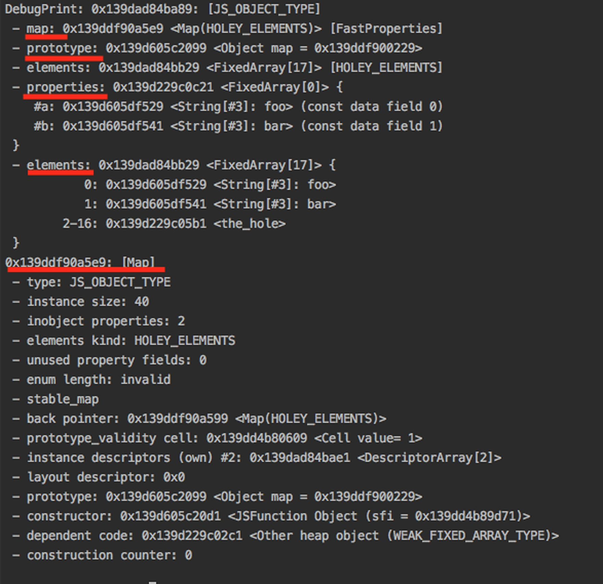
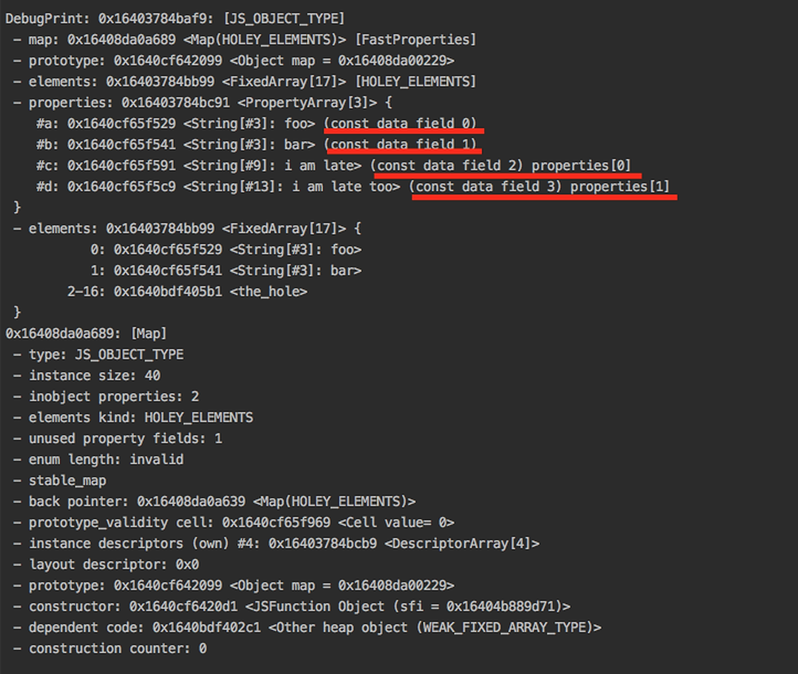
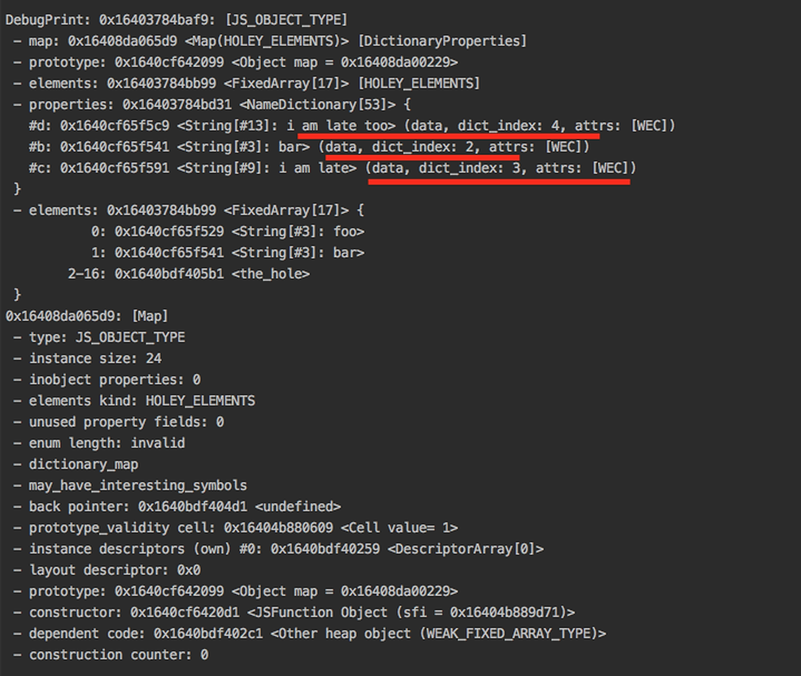

### Javascript Objects
They are mutable data types (can be altered) created by literals and compared by reference maintaining unique identities.
They are the collection of properties, mapping between objects and keys, and values.


### Run
```sh 
    d8 --allow-natives-syntax object.js
```


### Output

##### 01. Object with inline properties
Object <b>test</b> for analysis

```
var test = {
    a: "foo",
    b: "bar",
    0: "foo",
    1: "bar",
};
```


##### 02. Fast Properties
Adding property c and d to test.
```
test.c = 'i am late';
test.d = 'i am late too';
```


##### 03. Dictionary Properties
Removing property a to test object.
```
delete test.a;
```

