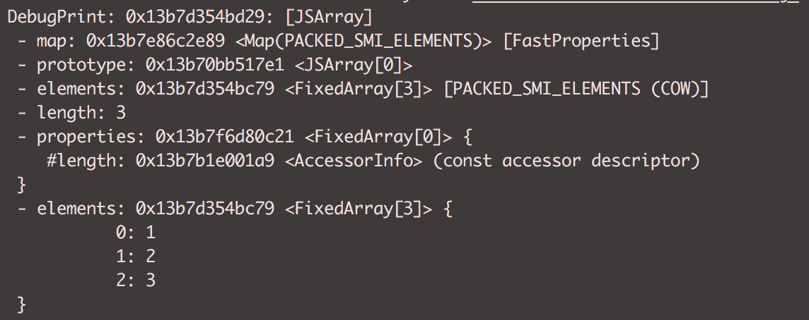
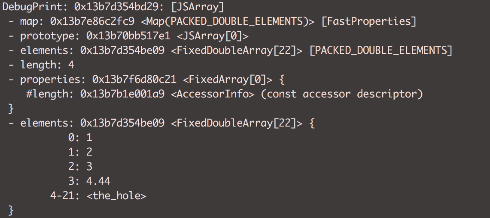
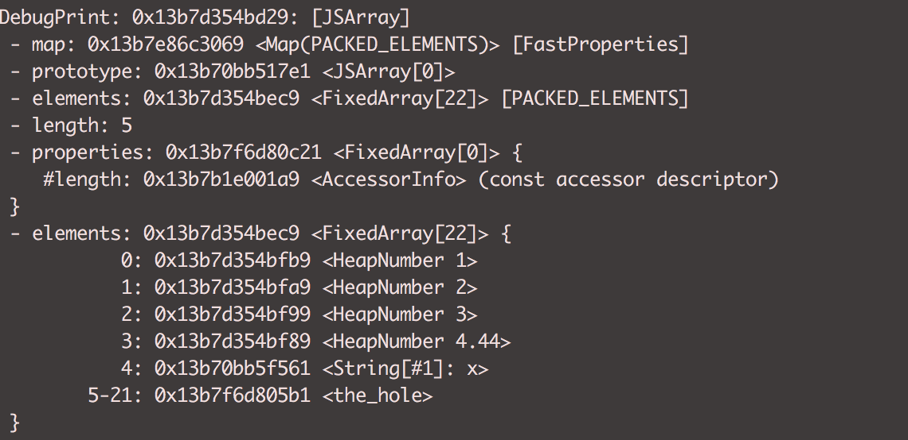
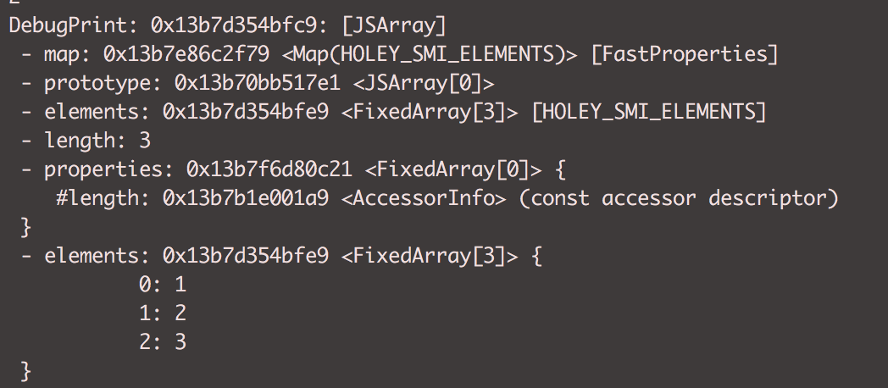
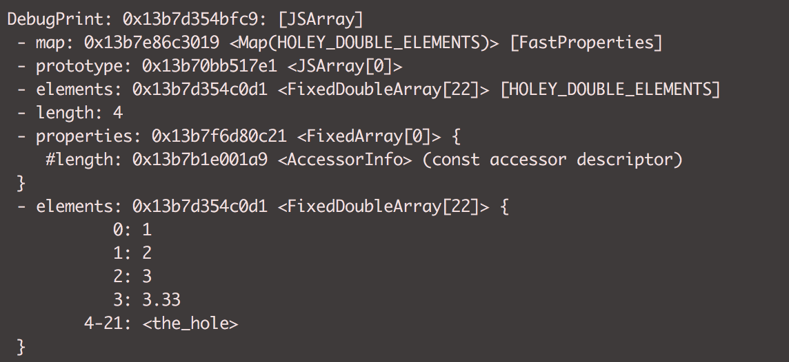
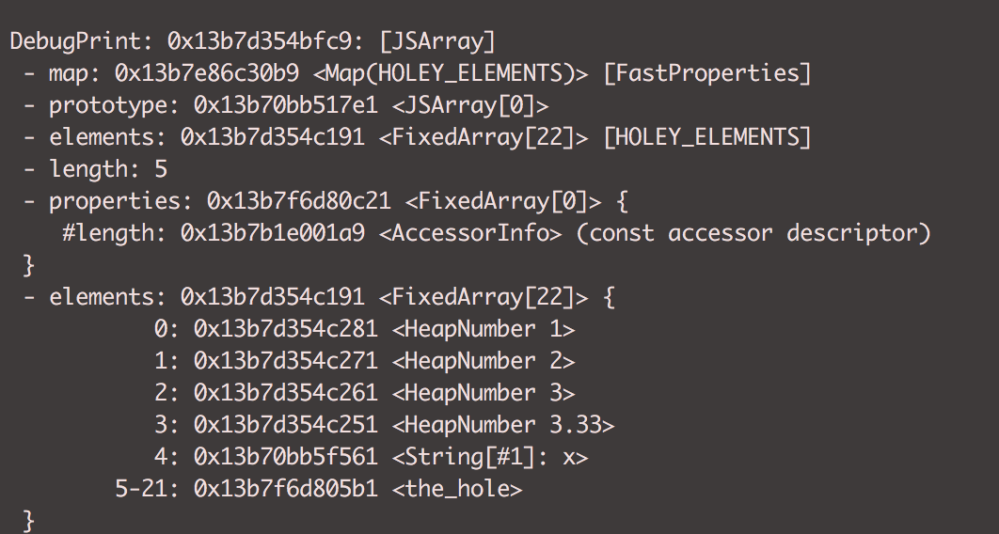

### Elements
Indexed properties in javascript are called elements and are treated separately from the named properties
They are mostly prominent in arrays and used for different prototype method.


### Run
```sh 
   d8 --allow-natives-syntax element-transition.js
```

### Output

#### 01. Packed SMI Elements
```
const array = [1, 2, 3];
```


#### 02. Packed Double Elements
```
array.push(4.44);
```


#### 03. Packed Elements
```
array.push('x');
```


#### 04. Holey SMI Elements
```
const newArray = [1, 2, 3];
delete newArray[1];
```


#### 05. Holey SMI Elements
```
newArray[1] = 2;
```

<br />
<b> Once hole is created it cannot be reverted back.</b>

#### 06. Holey Double Elements
```
newArray.push(3.33);
```


#### 07. Holey Elements
```
newArray.push('x');
```


