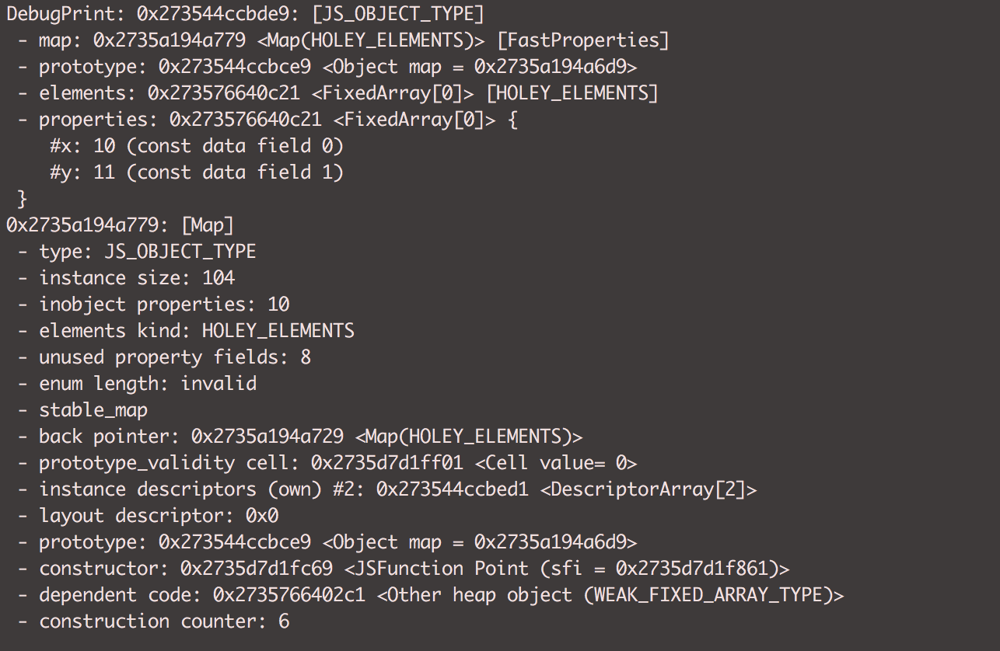
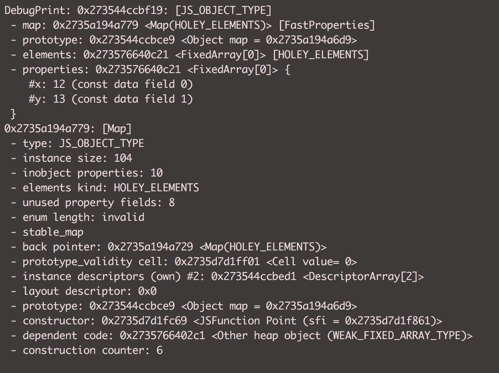

### Elements
Indexed properties in javascript are called elements and are treated separately from the named properties
They are mostly prominent in arrays and used for different prototype method.


### Run
```sh 
   d8 --allow-natives-syntax hidden-class.js
```


### Output

##### 01. Hidden Class for P1


##### 02. Hidden Class for P2


##### 03. Adding properties to Class
<b>
    Adding Numbered/Named Properties to Object
</b>

<br /> 


