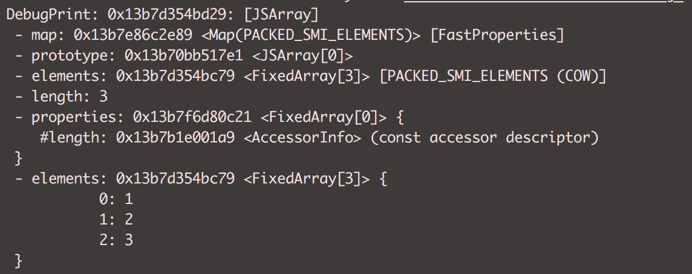
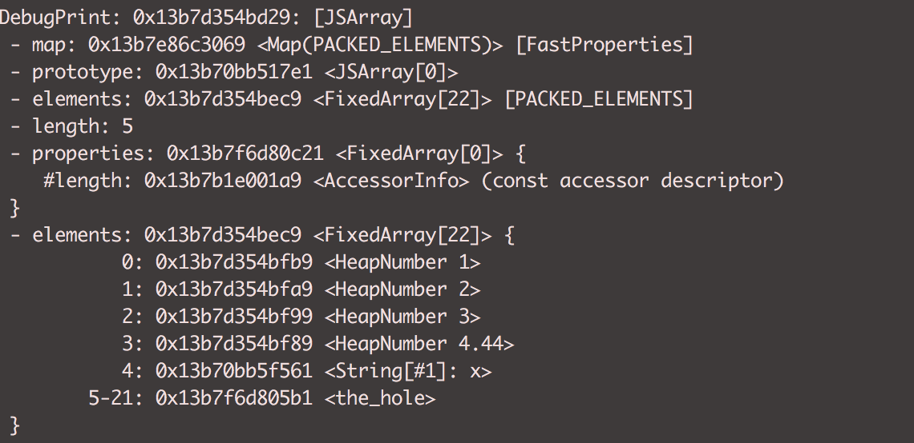
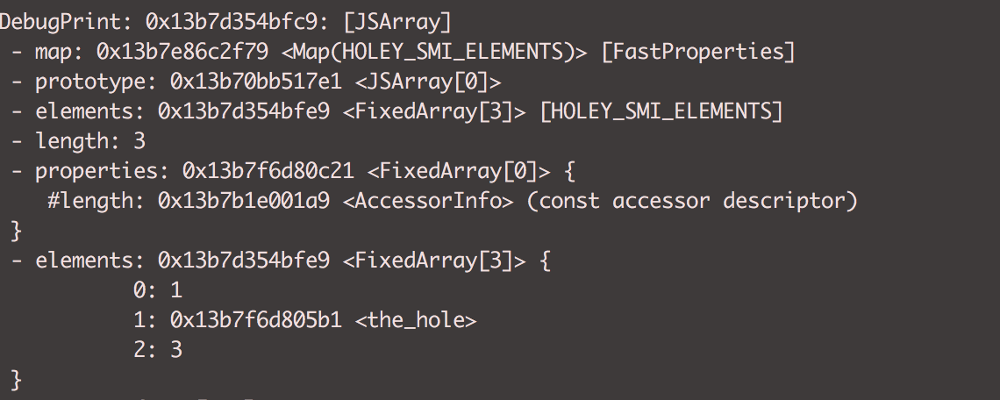
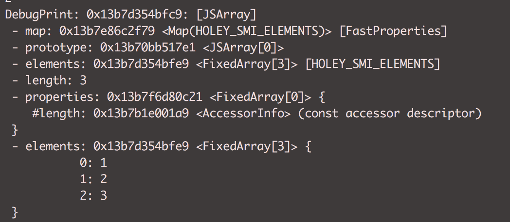
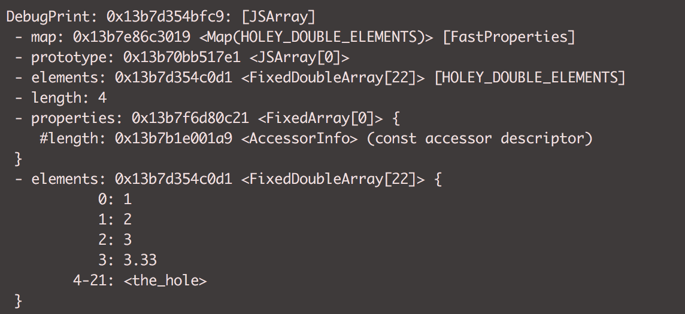

### Elements
Indexed properties in javascript are called elements and are treated separately from the named properties
They are mostly prominent in arrays and used for different prototype method.


### Run
```sh 
   d8 --allow-natives-syntax element-transition.js
```


###Output

##### 01. SMI Elements


##### 02. Packed Double Elements


##### 03. Packed Elements


##### 04. Holey SMI Elements


##### 05. Holey SMI Elements


##### 06. Holey Double Elements


##### 07. SMI Elements


